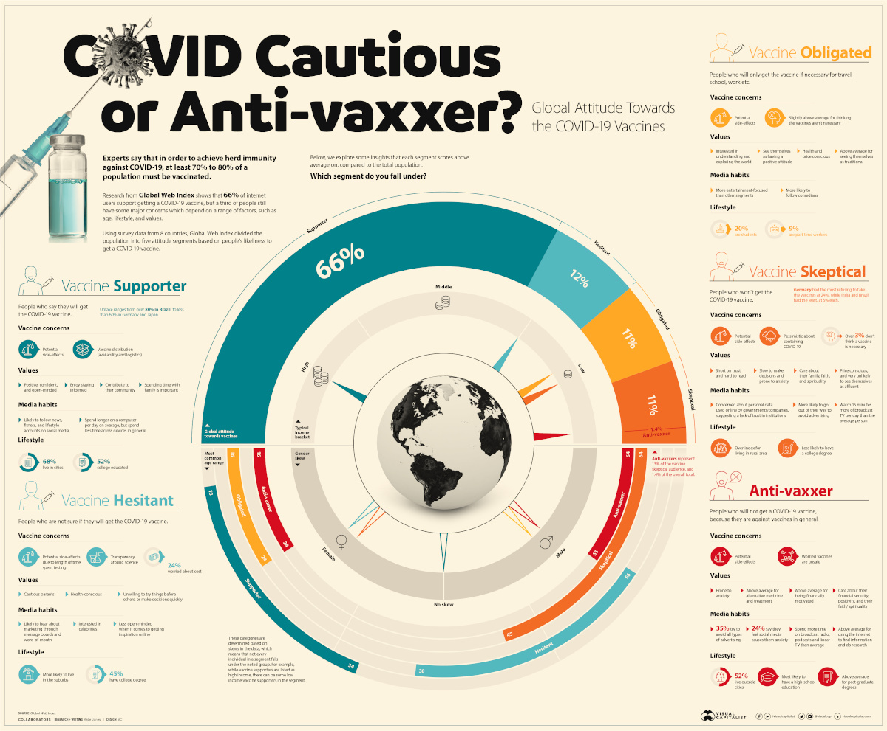
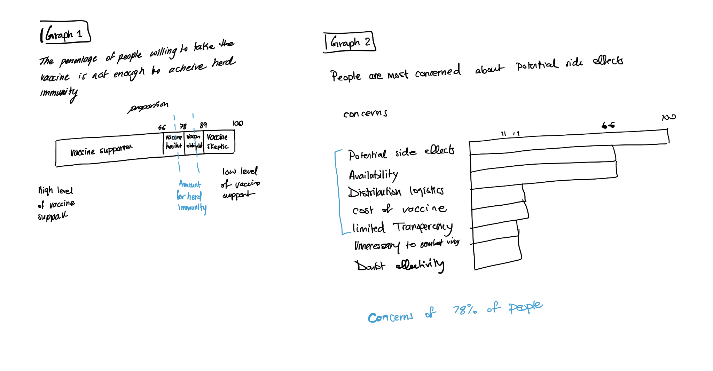

# Critique By Design

## The Design To Be Critiqued
[Click here to visit the link the of the visualization to be critiqued](https://www.visualcapitalist.com/visualizing-global-attitudes-towards-covid-19-vaccines/)

This is the visualization to be critiqued.

(Source: Jones. K. (2021) Visualizing Global Attitudes Towards the COVID-19 Vaccines. Retrieved from: https://www.visualcapitalist.com/visualizing-global-attitudes-towards-covid-19-vaccines/ )

I selected this visualization because I thought it had a lot of important messages that were burried in this graph. An influx of important messages would give no message a priority. Which is why I thought it would be interesting to redesign this visualization, and pick one important message and display it in a simple way to give it importance. 

The next step was to critique the visualization. This step was submitted in the survey. A backup of the questions can be found in the following page.
[Critique Backup](CritiqueBackup.md)

## The Process

### WireFraming
After picking the visualization, I started the critique. The critique process helped flesh out the problems of the visualization. The biggest issue in this visualization is how complex, busy, and cluttered it is. At the begining of the critique, I was unsure about the purpose of the visualization. The more I assessed it, the more small stories I was able to extract from the data. I picked the first two aparent stories that I was able to extract to focus the redesign on. 

I deduced that the most important purpose of the visualization is to relay the message that the percentage of people willing to get vaccinated is below the percentage necessary to gain herd immunity. This information alone is hopeless, and I thought it must be followed by data that would help guide the discussion to solve this problem. For the next visualization, I decided to list the concerns people gave alongside the percentage of people who had those concerns. In the second visualization I also wanted to highlight all the concerns for vaccine supporters and vaccine hesitants. This is because these two groups together make 78% of the population. Therfore, if the concerns were all addressed in order of priority, then more people are likely to be convinced to take the vaccine. The wireframes were created based on this idea. 

### Testing the solution
[Click here to find the user testing questions and answers](UserTesting.md)

I did some user testing on my sisters. I gained some important insight that gave me ideas on how to further improve the visualizations. This also made me aware of some vagueness in my visualizations. I realized that in the journey to simplify the original visualization, I ended up oversimplifying the visualizations. These are the notes I made from each interview.

Notes from interview 1: When I put 100 I meant percentages but the viewer thought it refered to the level of support which must have been confusing. I was unaware that other people might think that this refers to the level of support. To solve this issue I will label the percentage better. Also, I will put up a legend for the level of support and use colors to signify the amount of support. I found it weird that this viewer, when looking at graph 2 notes the bottom concerns not the top. I wanted to highlight the top 4, so I will make sure they are better highlighted. 

Notes from interview 2: I just realized that the naming of each level of support is confusing. I took the names from the source which was much more informative. Now that I simplified it, the naming alone without context does not make any sense. I will edit the name of each level of support. I will make sure I label correctly. Also, I will edit the part that highlights the concerns of 78% of people. I meant to highlight all the concerns from the 78% people with higher support. This is so the decision maker can prioratise them in order to achieve herd immunity. I will try to make sure that this is clear. 

## The Final Data Visualizations

The main aspect I worked on is simplifying the visualization. I thought the orignal was very busy and told so many stories at once, which made it very hard to distinguish the purpose of the graph. I picked one story that I found and used the data to create two simple visualization that can tell it more clearly. I focused the purpose of the visualization on showing that the amount of people who are willing to get vaccinated is not enough to achieve herd immunity. Then I continued the story by creating a seperate graph that showcases the concerns and the percentage of people who have them. I wanted to highlight all the concerns that the supportive people had. This is because if those are addressed, and everyone who had some level of vaccine support decided to get vaccinated, herd immunity would be achieved. 

These are the two redesigned visualizations. 

## Data Visualization 1

## Data Visualization 2

