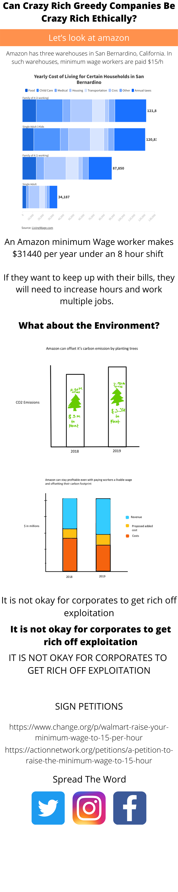

# Final Project: Part 2

## WireFraming/storyboards

## User Testing

[Click here for the full interview scripts](/UserTestingProject.md)

## Repurposing
### problem 1: No Purpose
I think it is important that I repurpose this graph. I thought I could somehow connect the environment with living wage but I think it just makes it confusing. If I were to connect the two by calling them ethics I would need 1 more measure for ethics. I think the users were confused because I called it ethics and I mentioned two unrelated things. If I added a third measure of ethics it might tie them together, but I think the best course is to get away from the environment and focus on living wage. 

I think I was telling two different stories and they do not relate to each other. Also at the same time, now after I read the feedback I realized there is no story told. It is just data. So I should add a story. 

### solution 1
New Purpose: Big corportations are greedy and exploitive. They under pay their workers. We should buy from local small businesses instead. If we all slowly move towards spending on small businesses, then we can all self employ ourselves. The more the demand for products made from small businesses the more people will be encouraged to open up their own business. 

I think I will get rid of the environmental visualizations. I will look into different corporates and how they underpay their workers. I will make the point that big corporations are exploitive. I will keep but fix the visualization on the living wage and on how much more it would cost the company to pay these workers well. This will show that Corporates can afford to pay their workers but they choose to exploit. The end of the story will be a message to support small businesses and recommendations of small online businesses to buy from. 

### problem 2: Unclear
It is unclear who the audience this is intended for. I think it is too general. I need to relate it to a specific audience. 

### solution 2: 
I will target young people who feel helpless when it comes to poverty and poor working conditions. I will target people looking for ways to help move this conversation and give them doable solutions. 

### problem 3: The users when asked about what they understood they just restated titles. 
I think the visualization are not good because the title says it all. I noticed that a lot of the viewers descriptions were repeated titles. If they just repeat what the title says then maybe the visualization does not add to the story. If the users read instead of see then I missed the point. I will need to fix this. I need to remove unessential things and make the data valuable. I will also try to look at the title alone, and then add the visualization and see if it adds to the story. If it does not add to the story, then either the title is descriptive or the visualization is pointless. I hope the problem is with the title. 

### solution 3:
I think the title should suggest what the user must look at, but not describe what they should believe or deduce. Also, I got a comment about how the breakdown of different categories in the annual cost of living is useless. I should either remove it, or use it to make the message more powerful. I can use this categorization to show that if people cannot afford the amount they will have to pick between necessities. Nobody should have a job that does not pay them enough, that they have to pick between food or shelter. 

### problem 4: Visibility issues
Some users complained about the size of the text. They also said the lables were unclear. While I will not deny that the text was small, and I could have done something to improve the visibility of the design, I think another problem was that the users looked at the visualization on the phone. I did not establish where my story would sit. I should pick a platform for the story. 

### solution 4: 
I think the story should be on the laptop. I will design it to look good on the laptop, and focus on visibility on a laptop screen. 

### problem 5: Clarity
Users commented that the story was unclear

### solution 4: 
I will try to fix that problem, and do more user testing to ensure this problem is solved. 

